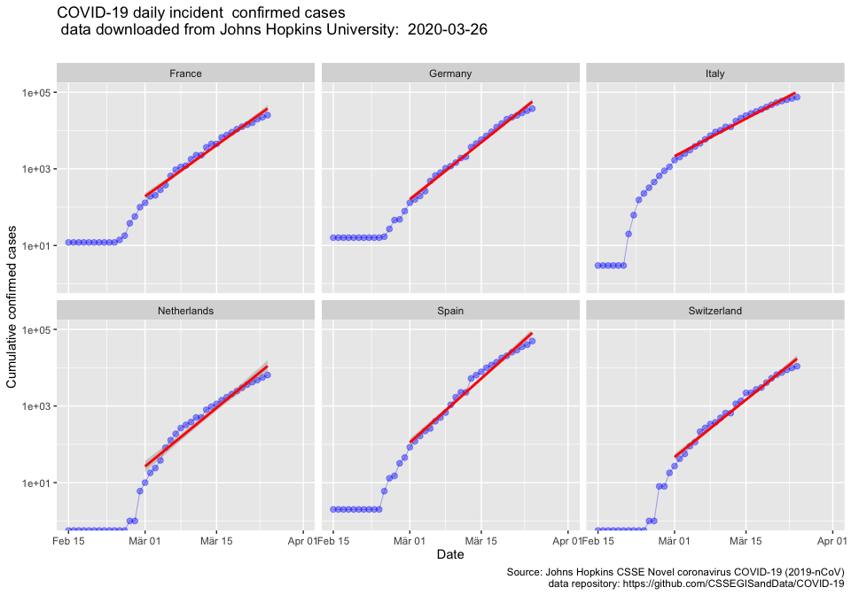

# COVID-19-Analysis
Analysis of available data of COVID incidences in order to visualize the dynamic of the COVID outbreak mainly in europe

I am physicist with a passion for analyzing an modeling data. Since I am not a medical professional or an epidemiologist please consider the things presented here as my personal analysis of the open available pandemic data.

### Phase of Exponential Growth

Currently, all countries in Europe are in the epidemic phase of were the increase of incidence can be described by a law of exponential growth. epidemiologist may write <em>Id=I0 * Cd</em>, where <em>Id, I0</em> are the number of infected people at day <em>d</em> and the initial value of infected people. The factor <em>C</em> contains the average number <em>E</em> of people, an infected person is exposed to each day, and the propability <em>p</em> of each exposure becoming an infection. The exponential growth can be slowed down, when <em>E</em> and/or <em>p</em> can be minimised. Instead of <em>C</em>, Physicists would use the exponential base <em>e</em>: <em>Id=I0 * e(k\*d)</em>. The logarithmic plot of cumulative incidences ln(Id/I0)=<em>k*d</em> over days yield a straight line, with the slope <em>k</em>. Finally the doubling time - the time it reqiures the number of infected has doubled -  can be calculated: <em>T2 = ln2/k</em>. In the following figure, the model fit is shown as a red line. 

So far, I analysed two periods, the begining and the end of march, separately to show how the doubling time has changed over time. The observed increase in doubling time by approimately a factor of 2 might be considered as the result of the social distancing and quarantine measures, that were intensified in european countries around the 15. of March 2020.

